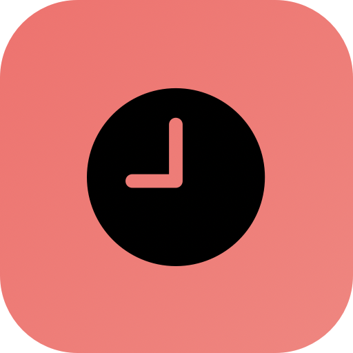

<p align="center">
  
</p>

<h1 align="center">Timezony</h1>

<p align="center">
  <strong>A delightful macOS menu bar app for tracking multiple timezones</strong>
</p>

<p align="center">
  <a href="https://github.com/FujiwaraChoki/timezony/releases"></a>
  <a href="https://swift.org"></a>
  <a href="LICENSE"></a>
  <a href="https://github.com/FujiwaraChoki/timezony/stargazers"></a>
</p>

<p align="center">
  
  
  
</p>

---

## Features

### Visual Time Bars
Beautiful 24-hour gradient bars showing day/night cycles at a glance. Instantly see if it's daytime or nighttime in any timezone.

### Time Converter
Need to schedule a call across timezones? Enter any time, select its timezone, and see what time that is everywhere else.

### Clean Menu Bar Experience
Lives quietly in your menu bar with no Dock icon. Click to open, click away to close.

### Effortless Management
- Search and add any timezone by city name
- Drag to reorder your timezones
- Hover to reveal delete button
- Persists your preferences automatically

---

## Screenshots

<p align="center">
  <i>Coming soon</i>
</p>

---

## Installation

### Download
Download the latest release from the [Releases](https://github.com/FujiwaraChoki/timezony/releases) page.

### Build from Source

**Requirements:**
- macOS 14.0 (Sonoma) or later
- Xcode 15.0 or later

```bash
# Clone the repository
git clone https://github.com/FujiwaraChoki/timezony.git
cd timezony

# Open in Xcode
open Timezony.xcodeproj

# Or build from command line
xcodebuild -project Timezony.xcodeproj -scheme Timezony -configuration Release build
```

---

## Usage

1. **Launch Timezony** - The app appears in your menu bar (clock icon)
2. **Click the icon** - Opens the timezone panel
3. **Add timezones** - Click the `+` button to search and add cities
4. **Convert times** - Expand "Convert Time" to see times across all zones
5. **Reorder** - Drag timezones to arrange them
6. **Remove** - Hover over a timezone and click the `×` button

### Default Timezones
Timezony comes pre-loaded with:
- New York (America/New_York)
- London (Europe/London)
- Tokyo (Asia/Tokyo)

---

## Architecture

```
Timezony/
├── TimeZonyApp.swift           # App entry point with MenuBarExtra
├── Models/
│   └── SavedTimezone.swift     # Timezone data model
├── ViewModels/
│   └── TimezoneManager.swift   # State management & persistence
├── Views/
│   ├── ContentView.swift       # Main popover view
│   ├── TimezoneRowView.swift   # Individual timezone display
│   ├── TimeBarView.swift       # Visual 24h gradient bar
│   ├── TimeConverterView.swift # Time conversion panel
│   └── AddTimezoneView.swift   # Search & add timezones
└── Utilities/
    └── Extensions.swift        # Helpers & color palette
```

### Tech Stack
- **SwiftUI** - Native declarative UI
- **MenuBarExtra** - Modern menu bar API (macOS 13+)
- **@Observable** - Swift 5.9 observation framework
- **TimelineView** - Efficient per-second updates
- **UserDefaults** - Lightweight persistence

---

## Color Palette

| Color | Hex | Usage |
|-------|-----|-------|
| Midnight | `#1A1A2E` | Night time gradient |
| Dawn | `#FF7E5F` | Sunrise gradient |
| Daylight | `#FEB47B` | Daytime gradient |
| Dusk | `#764BA2` | Sunset gradient |
| Coral | `#FF6B6B` | Accent color |

---

## Contributing

Contributions are welcome! Please feel free to submit a Pull Request.

1. Fork the repository
2. Create your feature branch (`git checkout -b feature/amazing-feature`)
3. Commit your changes (`git commit -m 'Add some amazing feature'`)
4. Push to the branch (`git push origin feature/amazing-feature`)
5. Open a Pull Request

### Development Setup

```bash
# Clone your fork
git clone https://github.com/YOUR_USERNAME/timezony.git

# Open in Xcode
open Timezony.xcodeproj
```

---

## License

This project is licensed under the MIT License - see the [LICENSE](LICENSE) file for details.

---

## Acknowledgments

- Built with SwiftUI and love
- Inspired by the need to coordinate across timezones
- SF Symbols for the beautiful icons

---

<p align="center">
  Made with ❤️ for remote teams everywhere
</p>
